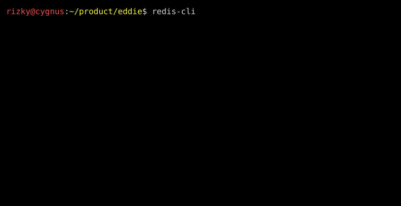
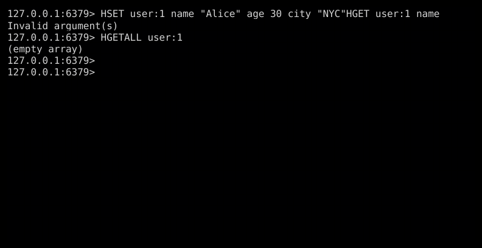
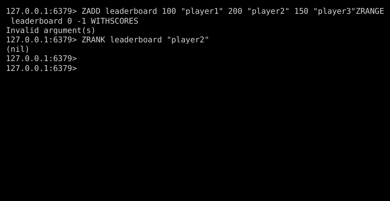

# Eddie 🖤

> *"We are Eddie."*

CLI screenshot tool for capturing **terminal sessions** and **Claude Code** interactions. Sister tool to [Parker](https://github.com/rizkyandriawan/parker).

## The Story

At the Daily Bugle, there are two photographers: **Peter Parker** and **Eddie Brock**. Same job—capture moments. Different vibes.

| Tool | Domain | Style | Captures |
|------|--------|-------|----------|
| **Parker** 🕷️ | Web Browser | Colorful, friendly | Web UI screenshots |
| **Eddie** 🖤 | Terminal | Dark, raw | CLI/Terminal sessions |

Parker shoots the web. Eddie captures the void.

## Screenshot Examples

### Redis CLI Tutorial








> See the complete [Redis Tutorial](examples/redis-tutorial.md) with all screenshots.

## What Eddie Does

Eddie automates terminal screenshot capture:

1. Runs any command in a PTY (bash, redis-cli, claude, etc.)
2. Sends input/keystrokes
3. Waits for output
4. Captures terminal state as PNG with colors
5. Generates manifest.json for tooling

## Installation

```bash
# Clone
git clone https://github.com/rizkyandriawan/eddie.git
cd eddie

# Build
go build -o eddie .

# (Optional) Install globally
sudo mv eddie /usr/local/bin/
```

## Quick Start

1. Create a config file:

```yaml
# redis-demo.yaml
output: ./screenshots
manifest: true

terminal:
  width: 80
  height: 20

theme:
  background: "#000000"
  font_size: 16
  padding: 12

sessions:
  - name: redis-ping
    command: "redis-cli"
    prompts:
      - wait: 500
        input: "PING"
      - key: "enter"
        wait: 300
        capture: true
        capture_name: "ping-pong"
```

2. Run Eddie:

```bash
eddie -c redis-demo.yaml
```

3. Check output:

```
./screenshots/
├── ping-pong.png
└── manifest.json
```

## Configuration

### Basic Structure

```yaml
output: ./screenshots      # Output directory
manifest: true             # Generate manifest.json

terminal:
  width: 80                # Terminal columns
  height: 24               # Terminal rows

theme:
  background: "#000000"    # Terminal background
  foreground: "#d4d4d4"    # Default text color
  font_size: 16            # Font size in pixels
  padding: 12              # Image padding

sessions:
  - name: session-name
    description: "What this captures"
    cwd: ~/path/to/dir     # Working directory
    command: "bash"        # Command to run (default: claude)
    prompts:
      - wait: 1000         # Wait before input (ms)
        input: "echo hello"
        capture: true
      - key: "enter"
        wait: 500
        capture: true
        capture_name: "result"
```

### Shell Commands (with prompt visible)

```yaml
sessions:
  - name: shell-demo
    command: "bash"        # Run bash to see username@hostname
    prompts:
      - wait: 500
        input: "redis-cli"
        capture: true      # Captures: user@host$ redis-cli
      - key: "enter"
        wait: 500
        capture: true      # Captures: 127.0.0.1:6379>
```

### Claude Code Sessions

```yaml
sessions:
  - name: claude-session
    command: "claude --continue"
    cwd: ~/projects/myapp
    prompts:
      - wait: 3000
        input: "explain this codebase"
        capture: true
      - key: "enter"
        wait: 30000
        capture: true
```

### Execution Order

Each prompt executes in order:
1. **wait** — Wait specified milliseconds
2. **input** — Send text (without Enter)
3. **key** — Send keystroke
4. **capture** — Take screenshot

### Supported Keys

| Key | Description |
|-----|-------------|
| `enter` | Enter/Return |
| `tab` | Tab |
| `escape` | Escape |
| `backspace` | Backspace |
| `up/down/left/right` | Arrow keys |
| `ctrl+c` | Interrupt |
| `ctrl+d` | EOF |
| `y`, `n`, etc. | Single characters |

## CLI Reference

```
eddie -c <config.yaml> [options]

OPTIONS:
    -c <path>       Path to YAML config file (required)
    -o <path>       Output directory (overrides config)
    --manifest      Generate manifest.json
    --version       Show version
    --help          Show help
```

## Output

### Manifest Format

```json
{
  "tool": "eddie",
  "version": "1.0.0",
  "generated_at": "2024-01-15T10:30:00Z",
  "terminal": {
    "width": 80,
    "height": 24,
    "theme": "dark"
  },
  "sessions": [...],
  "summary": {
    "total_sessions": 1,
    "total_screenshots": 3,
    "success": 1,
    "failed": 0
  }
}
```

## Examples

| Example | Description |
|---------|-------------|
| [redis-simple.yaml](examples/redis-simple.yaml) | Basic Redis PING/PONG |
| [redis-tutorial-config.yaml](examples/redis-tutorial-config.yaml) | Full Redis tutorial screenshots |
| [redis-tutorial.md](examples/redis-tutorial.md) | Complete Redis tutorial with screenshots |

## How It Works

Eddie uses:
- **PTY** (`github.com/creack/pty`) — Run commands in pseudo-terminal
- **vt10x** (`github.com/hinshun/vt10x`) — Virtual terminal emulator for proper TUI rendering
- **gg** (`github.com/fogleman/gg`) — 2D graphics for PNG rendering

This allows capturing TUI apps (htop, vim, claude) with proper colors and cursor positioning.

## Parker + Eddie Workflow

Use both tools for complete documentation:

```bash
# Capture web UI screenshots
parker -c web-config.yaml -o ./docs/web --manifest

# Capture CLI screenshots
eddie -c cli-config.yaml -o ./docs/cli --manifest
```

## Requirements

- Go 1.22+
- A monospace font (DejaVu Sans Mono, Liberation Mono, etc.)

## License

MIT

---

*Parker shoots the web. Eddie captures the void.* 🖤
