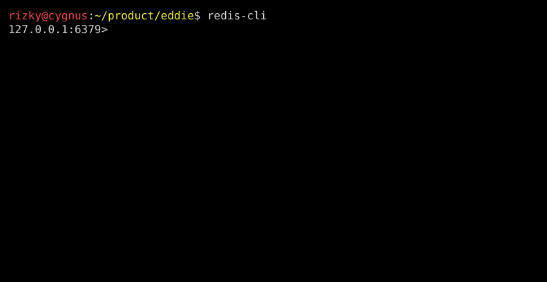
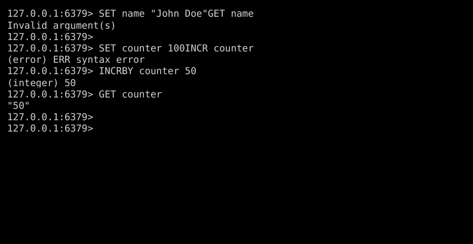
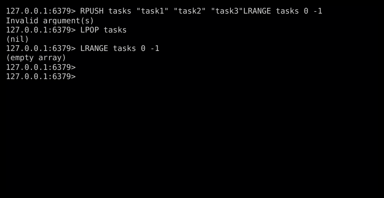
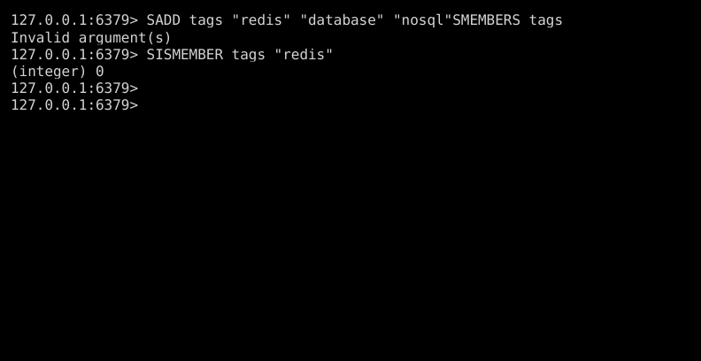
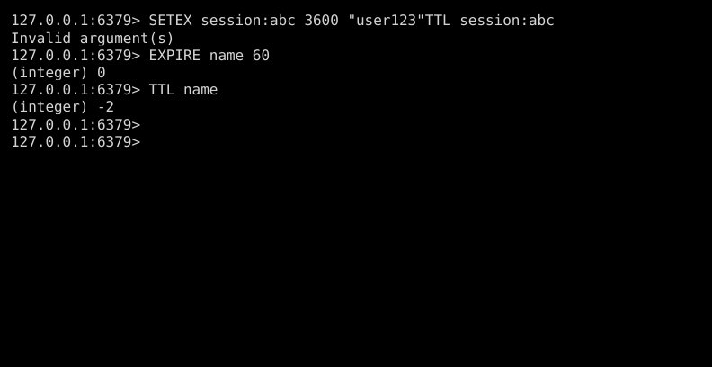
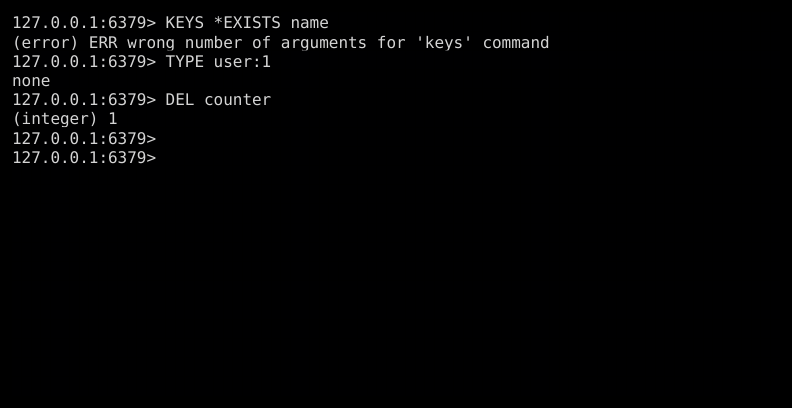

# Redis Tutorial: From Zero to Hero

A comprehensive guide to Redis, the in-memory data structure store. This tutorial covers all essential Redis commands with practical examples.

> **Note:** Screenshots in this tutorial were generated using [Eddie](https://github.com/rizkyandriawan/eddie), a CLI screenshot tool.

---

## Table of Contents

1. [Introduction](#introduction)
2. [Connecting to Redis](#connecting-to-redis)
3. [Basic Commands](#basic-commands)
4. [Strings](#strings)
5. [Hashes](#hashes)
6. [Lists](#lists)
7. [Sets](#sets)
8. [Sorted Sets](#sorted-sets)
9. [Key Expiration](#key-expiration)
10. [Key Operations](#key-operations)
11. [Use Cases](#use-cases)

---

## Introduction

**Redis** (Remote Dictionary Server) is an open-source, in-memory data structure store that can be used as:

- **Database** — Persistent key-value storage
- **Cache** — Fast data retrieval layer
- **Message Broker** — Pub/Sub messaging system
- **Queue** — Task/job queue management

### Why Redis?

| Feature | Benefit |
|---------|---------|
| In-memory | Extremely fast (sub-millisecond latency) |
| Data structures | Strings, Hashes, Lists, Sets, Sorted Sets |
| Persistence | Optional disk persistence (RDB/AOF) |
| Replication | Master-replica support |
| Clustering | Horizontal scaling |

---

## Connecting to Redis

First, connect to your Redis server using `redis-cli`:

```bash
redis-cli
```


Once connected, you'll see the Redis prompt:



### Connection Options

```bash
# Connect to specific host/port
redis-cli -h localhost -p 6379

# Connect with password
redis-cli -a yourpassword

# Connect to specific database
redis-cli -n 1
```

---

## Basic Commands

### PING — Check Connection

The simplest command to verify your connection:

```
127.0.0.1:6379> PING
PONG
```


### Other Basic Commands

| Command | Description |
|---------|-------------|
| `PING` | Test connection |
| `ECHO "message"` | Echo a message |
| `SELECT 0-15` | Switch database |
| `DBSIZE` | Number of keys in current DB |
| `FLUSHDB` | Delete all keys in current DB |
| `FLUSHALL` | Delete all keys in all DBs |

---

## Strings

Strings are the most basic Redis data type. They can hold any data: text, numbers, or binary data (up to 512MB).

### SET / GET

```
SET name "John Doe"
GET name
```


### INCR / INCRBY

Perfect for counters:

```
SET counter 100
INCR counter        # 101
INCRBY counter 50   # 151
GET counter
```



### String Commands Reference

| Command | Example | Description |
|---------|---------|-------------|
| `SET key value` | `SET name "John"` | Set a value |
| `GET key` | `GET name` | Get a value |
| `MSET k1 v1 k2 v2` | `MSET a 1 b 2` | Set multiple |
| `MGET k1 k2` | `MGET a b` | Get multiple |
| `INCR key` | `INCR views` | Increment by 1 |
| `INCRBY key n` | `INCRBY views 10` | Increment by n |
| `DECR key` | `DECR stock` | Decrement by 1 |
| `APPEND key value` | `APPEND name " Doe"` | Append to string |
| `STRLEN key` | `STRLEN name` | Get string length |

---

## Hashes

Hashes are maps of field-value pairs — perfect for representing objects.

### HSET / HGET / HGETALL

```
HSET user:1 name "Alice" age 30 city "NYC"
HGET user:1 name
HGETALL user:1
```


### Hash Commands Reference

| Command | Example | Description |
|---------|---------|-------------|
| `HSET key field value` | `HSET user:1 name "Alice"` | Set field |
| `HGET key field` | `HGET user:1 name` | Get field |
| `HMSET key f1 v1 f2 v2` | `HMSET user:1 a 1 b 2` | Set multiple fields |
| `HGETALL key` | `HGETALL user:1` | Get all fields |
| `HDEL key field` | `HDEL user:1 age` | Delete field |
| `HEXISTS key field` | `HEXISTS user:1 name` | Check if field exists |
| `HKEYS key` | `HKEYS user:1` | Get all field names |
| `HVALS key` | `HVALS user:1` | Get all values |
| `HINCRBY key field n` | `HINCRBY user:1 age 1` | Increment field |

### Use Case: User Profile

```
HSET user:1001
    username "alice123"
    email "alice@example.com"
    created_at "2024-01-15"
    login_count 0

HINCRBY user:1001 login_count 1
```

---

## Lists

Lists are linked lists of strings — great for queues, stacks, and recent items.

### RPUSH / LPUSH / LRANGE / LPOP

```
RPUSH tasks "task1" "task2" "task3"
LRANGE tasks 0 -1
LPOP tasks
LRANGE tasks 0 -1
```



### List Commands Reference

| Command | Example | Description |
|---------|---------|-------------|
| `LPUSH key value` | `LPUSH queue "job1"` | Push to head |
| `RPUSH key value` | `RPUSH queue "job2"` | Push to tail |
| `LPOP key` | `LPOP queue` | Pop from head |
| `RPOP key` | `RPOP queue` | Pop from tail |
| `LRANGE key start stop` | `LRANGE queue 0 -1` | Get range |
| `LLEN key` | `LLEN queue` | Get length |
| `LINDEX key index` | `LINDEX queue 0` | Get by index |
| `LSET key index value` | `LSET queue 0 "new"` | Set by index |

### Use Case: Task Queue

```
# Producer: Add jobs
RPUSH job_queue '{"type":"email","to":"user@example.com"}'

# Consumer: Process jobs
LPOP job_queue
```

### Use Case: Recent Activity

```
# Add activity (keep last 100)
LPUSH user:1:activity "Logged in"
LTRIM user:1:activity 0 99

# Get recent 10
LRANGE user:1:activity 0 9
```

---

## Sets

Sets are unordered collections of unique strings — perfect for tags, unique visitors, etc.

### SADD / SMEMBERS / SISMEMBER

```
SADD tags "redis" "database" "nosql"
SMEMBERS tags
SISMEMBER tags "redis"
```



### Set Commands Reference

| Command | Example | Description |
|---------|---------|-------------|
| `SADD key member` | `SADD tags "redis"` | Add member |
| `SREM key member` | `SREM tags "redis"` | Remove member |
| `SMEMBERS key` | `SMEMBERS tags` | Get all members |
| `SISMEMBER key member` | `SISMEMBER tags "redis"` | Check membership |
| `SCARD key` | `SCARD tags` | Get set size |
| `SINTER key1 key2` | `SINTER set1 set2` | Intersection |
| `SUNION key1 key2` | `SUNION set1 set2` | Union |
| `SDIFF key1 key2` | `SDIFF set1 set2` | Difference |

### Use Case: Unique Visitors

```
# Track unique visitors per day
SADD visitors:2024-01-15 "user:1001" "user:1002" "user:1003"

# Count unique visitors
SCARD visitors:2024-01-15
```

### Use Case: Tags/Categories

```
SADD post:1:tags "redis" "tutorial" "database"
SADD post:2:tags "redis" "performance"

# Posts with both tags
SINTER post:1:tags post:2:tags
```

---

## Sorted Sets

Sorted sets are sets with a score — perfect for leaderboards, rankings, and priority queues.

### ZADD / ZRANGE / ZRANK

```
ZADD leaderboard 100 "player1" 200 "player2" 150 "player3"
ZRANGE leaderboard 0 -1 WITHSCORES
ZRANK leaderboard "player2"
```


### Sorted Set Commands Reference

| Command | Example | Description |
|---------|---------|-------------|
| `ZADD key score member` | `ZADD lb 100 "p1"` | Add with score |
| `ZRANGE key start stop` | `ZRANGE lb 0 -1` | Get by rank (low→high) |
| `ZREVRANGE key start stop` | `ZREVRANGE lb 0 -1` | Get by rank (high→low) |
| `ZRANK key member` | `ZRANK lb "p1"` | Get rank (low→high) |
| `ZREVRANK key member` | `ZREVRANK lb "p1"` | Get rank (high→low) |
| `ZSCORE key member` | `ZSCORE lb "p1"` | Get score |
| `ZINCRBY key n member` | `ZINCRBY lb 10 "p1"` | Increment score |
| `ZCOUNT key min max` | `ZCOUNT lb 0 100` | Count in score range |

### Use Case: Leaderboard

```
# Add/update scores
ZADD game:leaderboard 1500 "player:alice"
ZINCRBY game:leaderboard 100 "player:alice"

# Top 10 players
ZREVRANGE game:leaderboard 0 9 WITHSCORES

# Player's rank
ZREVRANK game:leaderboard "player:alice"
```

---

## Key Expiration

Redis can automatically delete keys after a specified time — essential for caching and sessions.

### SETEX / EXPIRE / TTL

```
SETEX session:abc 3600 "user123"    # Set with 1 hour TTL
TTL session:abc                      # Check remaining time

EXPIRE name 60                       # Add TTL to existing key
TTL name
```



### Expiration Commands Reference

| Command | Example | Description |
|---------|---------|-------------|
| `EXPIRE key seconds` | `EXPIRE name 60` | Set TTL in seconds |
| `PEXPIRE key ms` | `PEXPIRE name 60000` | Set TTL in milliseconds |
| `EXPIREAT key timestamp` | `EXPIREAT name 1704067200` | Set expiry time |
| `TTL key` | `TTL name` | Get remaining TTL (seconds) |
| `PTTL key` | `PTTL name` | Get remaining TTL (ms) |
| `PERSIST key` | `PERSIST name` | Remove TTL |
| `SETEX key sec value` | `SETEX token 3600 "abc"` | SET + EXPIRE |

### Use Case: Session Management

```
# Create session (1 hour TTL)
SETEX session:abc123 3600 '{"user_id":1001,"role":"admin"}'

# Refresh on activity
EXPIRE session:abc123 3600

# Check session
GET session:abc123
TTL session:abc123
```

### Use Case: Rate Limiting

```
# Simple rate limiter (10 requests per minute)
INCR rate:user:1001
EXPIRE rate:user:1001 60

# Check count
GET rate:user:1001
```

---

## Key Operations

General commands for managing keys.

### KEYS / EXISTS / TYPE / DEL

```
KEYS *              # List all keys (careful in production!)
EXISTS name         # Check if key exists
TYPE user:1         # Get key type
DEL counter         # Delete key
```



### Key Commands Reference

| Command | Example | Description |
|---------|---------|-------------|
| `KEYS pattern` | `KEYS user:*` | Find keys by pattern |
| `SCAN cursor` | `SCAN 0 MATCH user:*` | Iterate keys (safe) |
| `EXISTS key` | `EXISTS name` | Check existence |
| `TYPE key` | `TYPE user:1` | Get type |
| `DEL key` | `DEL name` | Delete key |
| `UNLINK key` | `UNLINK name` | Async delete |
| `RENAME key new` | `RENAME old new` | Rename key |
| `COPY src dst` | `COPY a b` | Copy key |

> **Warning:** Avoid `KEYS *` in production — use `SCAN` instead for large databases.

---

## Use Cases

### 1. Caching

```
# Cache database query result
SETEX cache:user:1001 300 '{"name":"Alice","email":"alice@example.com"}'

# Check cache first
GET cache:user:1001
```

### 2. Session Storage

```
HSET session:abc123 user_id 1001 role "admin" last_access "2024-01-15"
EXPIRE session:abc123 3600
```

### 3. Real-time Leaderboard

```
ZADD leaderboard 1500 "player1"
ZINCRBY leaderboard 100 "player1"
ZREVRANGE leaderboard 0 9 WITHSCORES
```

### 4. Rate Limiting

```
# Increment and set expiry atomically
SET rate:ip:192.168.1.1 1 EX 60 NX
INCR rate:ip:192.168.1.1
```

### 5. Pub/Sub Messaging

```
# Terminal 1: Subscribe
SUBSCRIBE notifications

# Terminal 2: Publish
PUBLISH notifications "New message!"
```

### 6. Job Queue

```
# Producer
RPUSH jobs '{"task":"send_email","to":"user@example.com"}'

# Consumer (blocking)
BLPOP jobs 0
```

---

## Quick Reference Card

| Data Type | Create | Read | Update | Delete |
|-----------|--------|------|--------|--------|
| String | `SET k v` | `GET k` | `SET k v` | `DEL k` |
| Hash | `HSET k f v` | `HGET k f` | `HSET k f v` | `HDEL k f` |
| List | `RPUSH k v` | `LRANGE k 0 -1` | `LSET k i v` | `LPOP k` |
| Set | `SADD k v` | `SMEMBERS k` | — | `SREM k v` |
| Sorted Set | `ZADD k s v` | `ZRANGE k 0 -1` | `ZADD k s v` | `ZREM k v` |

---

## Next Steps

1. **Persistence** — Learn about RDB snapshots and AOF logs
2. **Replication** — Set up master-replica for high availability
3. **Clustering** — Scale horizontally with Redis Cluster
4. **Lua Scripting** — Write atomic operations with `EVAL`
5. **Streams** — Use Redis Streams for event sourcing

---

*Tutorial generated with [Eddie](https://github.com/rizkyandriawan/eddie) — the CLI screenshot tool.* 🖤
